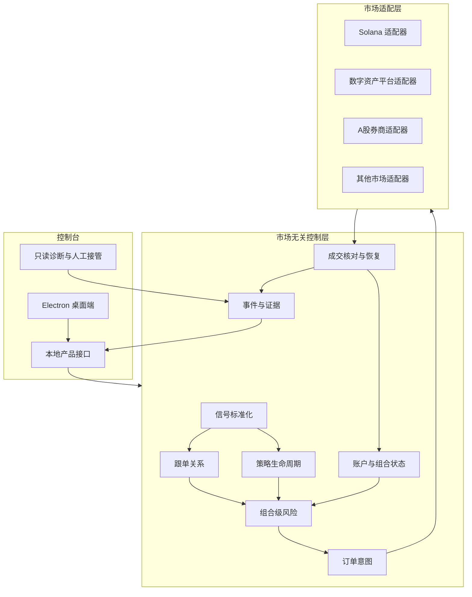
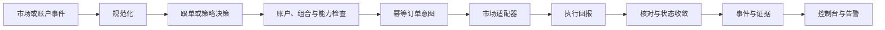

# TAIL 平台架构

TAIL 的核心不是某一个桌面页面，也不是某一个市场机器人，而是连接策略、账户、风险、执行状态和证据的市场无关控制层。

## 总体分层

桌面端只负责控制、观察、配置和人工接管。持续运行的行情、策略、跟单、风控与执行服务必须独立于桌面窗口，否则无法可靠支撑长期运行和数千级关系。

## 统一交易语义

市场无关控制层只保存跨市场能够稳定表达的对象：

- 标准化市场事件；
- 策略信号；
- 跟单关系与比例规则；
- 账户和组合快照；
- 风险预算与限制；
- 订单意图，而不是市场原始订单；
- 执行回报与核对状态；
- 退出、恢复和人工接管状态；
- 不可变事件与证据引用。

## 市场专用边界

每个市场适配器单独处理：

- 行情和账户协议；
- 交易日历与交易时段；
- 订单类型、数量单位和价格规则；
- 费用、滑点和流动性模型；
- 成交确认、撤单和异常恢复；
- 市场、券商、交易平台和数据授权约束。

因此，扩展 A股不是修改 Solana 执行代码，而是在统一控制层下增加独立的 A股数据、规则、风控和券商适配器。

## 事件与执行原则

- 不依赖“恰好执行一次”的幻想；采用可重放事件、幂等意图和成交核对控制重复执行。
- 界面状态不是交易事实，必须从权威回报和核对结果重新得到。
- 单账户风险、策略风险和全局风险分别计算，不能只在页面按钮处限制。
- 自动化必须默认禁用，并具备明确授权、停止、恢复与人工接管路径。

## 当前与目标的边界

| 层级 | 当前状态 |
| --- | --- |
| 桌面控制台和主要工作区 | 已具备候选实现；当前默认简体中文 |
| 本地产品状态、能力登记和只读投影 | 已具备基础 |
| 研究、模拟、回放与诊断 | 已具备部分基础 |
| 市场无关交易控制层 | 正在形成，尚未形成完整公开闭环 |
| 单市场真实执行闭环 | 未授权、未证明 |
| 数千级容量 | 架构目标，尚未完成基准测试 |
| A股及其他市场 | 扩展方向，尚未接入 |

## 公开信任边界

Showcase 只公开控制台、脱敏接口、固定演示数据、架构和安全边界。真实执行、授权签发、生产 Canary、治理证据和凭据始终位于私有边界，不通过源码、历史或构建产物进入公开仓库。
