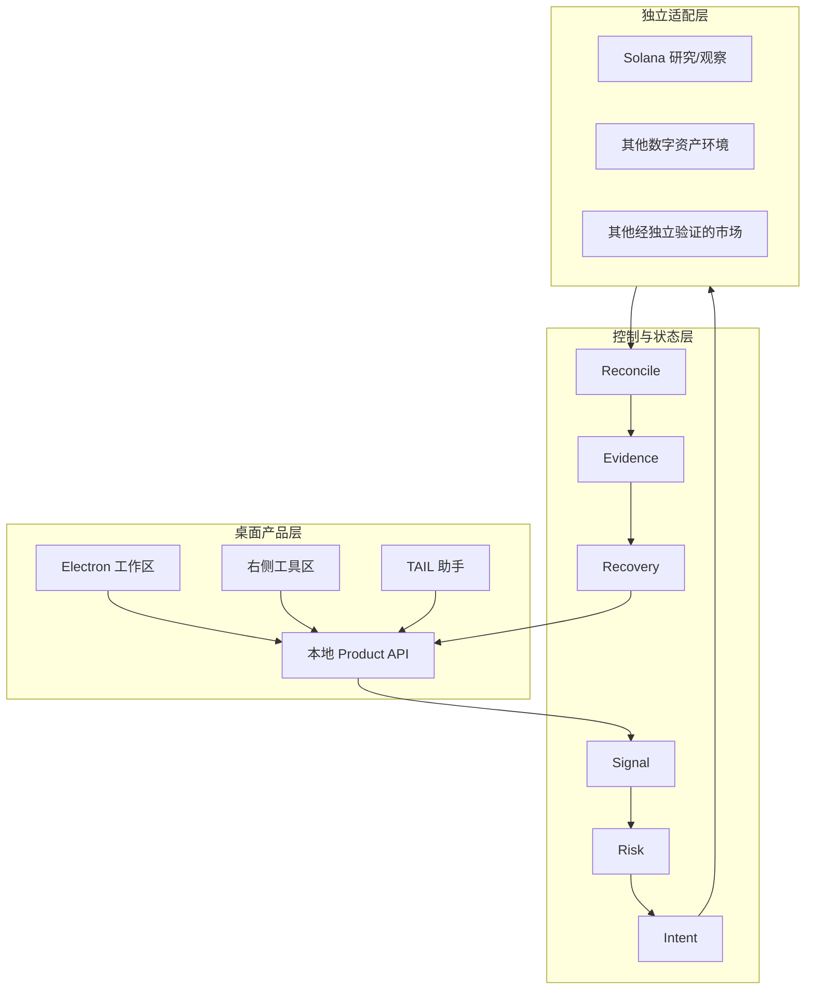

# TAIL 平台架构

TAIL 的核心目标是把策略、风险、订单意图、状态核对、Evidence 和恢复连接成一条可追踪链路。桌面 UI 是观察与控制表面，不是交易事实来源。

## 总体分层



## 关键原则

1. **界面不是账本。** 页面显示来自受控投影，不能反向创造交易事实。
2. **意图不是成交。** 订单意图、提交、广播、确认和最终核对是不同状态。
3. **不假设恰好一次。** 使用可重放事件、幂等标识和核对处理重复与不确定结果。
4. **失败关闭。** 数据缺失、过期、来源不明或结果歧义时，不继续高风险动作。
5. **桌面与持续运行分离。** 桌面可以退出，长期任务不能依赖窗口存活。
6. **市场规则隔离。** 每个市场的数据、时段、订单规则、费用、确认和授权单独验证。

## 公开预览架构

0.4.1 公开包使用专门的只读 Showcase 入口：

```text
Electron UI
  → loopback-only Product API
  → 断连/未知状态或明确标注的本地合成样本
```

公开构建通过别名替换生产市场服务与完整离线应用，不打包私有任务脚本、生产启动器、生产 Canary 或源码映射。研究按钮在公开模式下保持锁定。

## 当前与目标

| 层级 | 当前状态 |
| --- | --- |
| 桌面工作区与工具区 | 已有可运行公开预览 |
| 本地只读产品状态 | 已接入公开预览 |
| 合成回测与 Fixture | 已接入并明确标注 |
| 私有研究与交易控制基础 | 仍在开发和验证 |
| 单市场真钱闭环 | 未授权、未证明 |
| 多市场适配 | 未来方向，逐市场验证 |
| 数千级容量 | 目标，尚无公开基准证明 |
