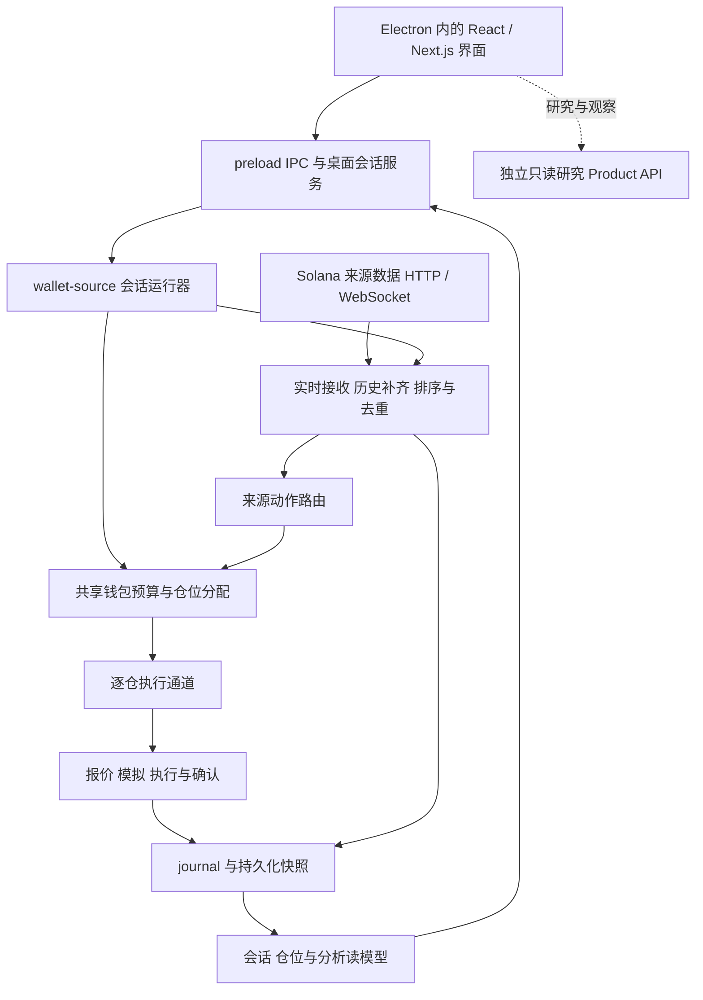
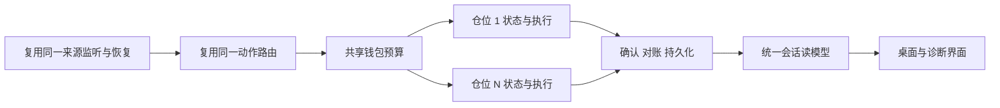

# TAIL 当前实现与演进

核对日期：2026-09-17。当前私有代码基线 `b2aa04a`，运行实现 `6b51173`。下图描述代码接线，不表示每条真实网络路径均已验证通过。

## 当前会话主链路

交易控制使用桌面 IPC 与会话运行器；研究 Product API 是另外一条只读路径。研究服务连通不能证明来源钱包监听或交易运行器健康。

## 实际实现位置

以下是私有代码中的模块位置，供理解边界，不是本公开仓库内的可点击源码文件。

| 层级 | 当前实现位置 | 职责 |
| --- | --- | --- |
| 桌面与页面 | `apps/desktop/src/main.ts`、`preload.ts`；`apps/web/app/tail/tail-shell.tsx` | 页面、IPC、原生确认与服务装配 |
| 会话控制 | `apps/desktop/src/wallet-source-session-service.ts` | 配置、启动停止与读模型 |
| 运行入口 | `scripts/tail-wallet-source-session.ts` | 装配来源、路由、预算与执行依赖 |
| 来源接收与恢复 | `wallet-source-runtime-composition-v2.ts`、`wallet-source-realtime-bridge-v2.ts` | 实时与补历史输入、持久边界、去重与恢复 |
| 路由和钱包预算 | `wallet-source-action-router-v2.ts`、`wallet-execution-portfolio-v2.ts` | 来源动作与仓位对应、共享资金预算 |
| 逐仓执行 | `wallet-source-session-execution-v2.ts` → `real-copy-automated-execution-v1.ts` | 复用已有执行与 journal 核对能力 |
| 数据展示 | `wallet-source-session-read-model.ts`、`wallet-source-session-analytics-read-model.ts` | 从持久化状态生成会话、仓位和时序投影 |

省略目录的执行模块位于 `platform/execution/real-copy/v2/`；`real-copy-automated-execution-v1.ts` 在其上一级。读模型位于 `apps/desktop/src/`。

旧单仓入口仍有历史实现与兼容用途，但不能继续把它描述为当前桌面会话的唯一入口。会话执行通道已复用既有执行核心，而不是完全重写买卖逻辑。

## 数据与状态如何区分

- 来源交易、跟随动作、提交签名、链上确认和最终持仓是不同记录。
- UI 使用会话读模型，未知预算或未核实数据不替换成虚构收益与余额。
- 停止来源与禁止新买入不等于清仓；已签名未决动作仍需要对账。
- 当前恢复、同 slot 顺序和故障传播仍有问题，持久化模块存在不代表恢复已经可靠。

## 公开下载版

2026-09-04 的 `v0.4.1-preview` 使用独立 Showcase 构建：Electron、静态 Web 与回环只读 Product API。它提供断连状态或明确标注的合成样本，不包含私有交易运行器。这与上面的私有会话架构是不同交付范围。

## 后续演进方向

当前已经有共享 portfolio 与逐仓 lane 的代码结构。后续重点是验证容量 1 与容量 N 下的同一条执行链、预算隔离和恢复行为，并减少重复状态来源。此图是收敛方向，不新增一个并行运行器，也不代表 N 仓实盘通过。

先完成现有来源与交易路径，其他市场、语言重写和额外服务按实际需求另行评估。[路线图](ROADMAP.md)列出每一步的可观察结果。
