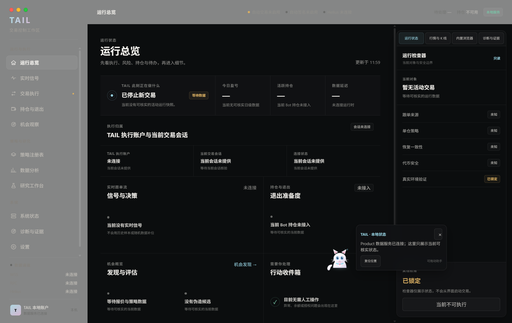
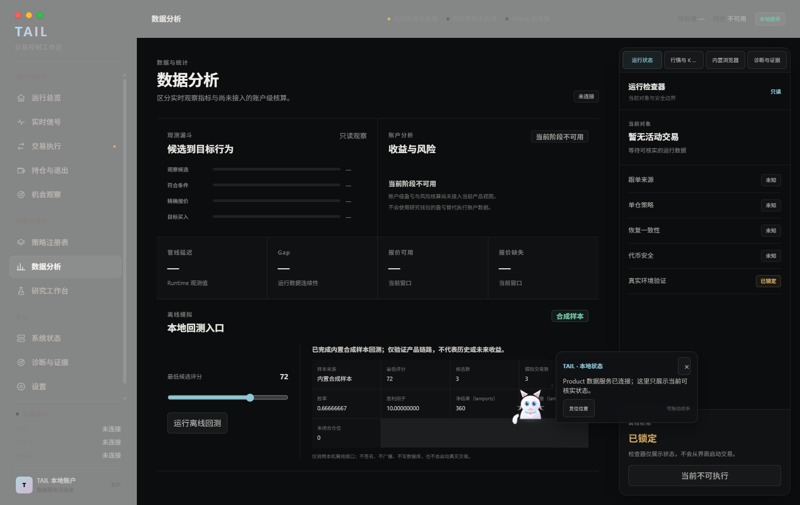
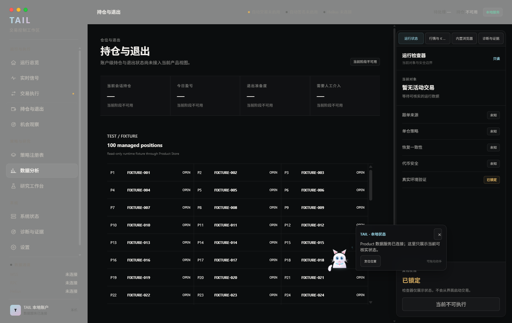
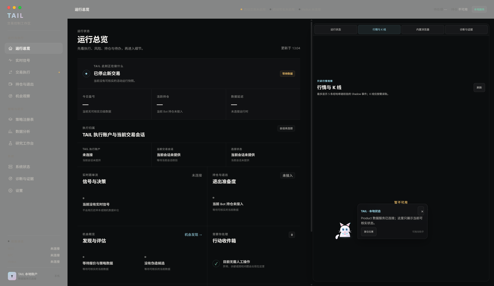
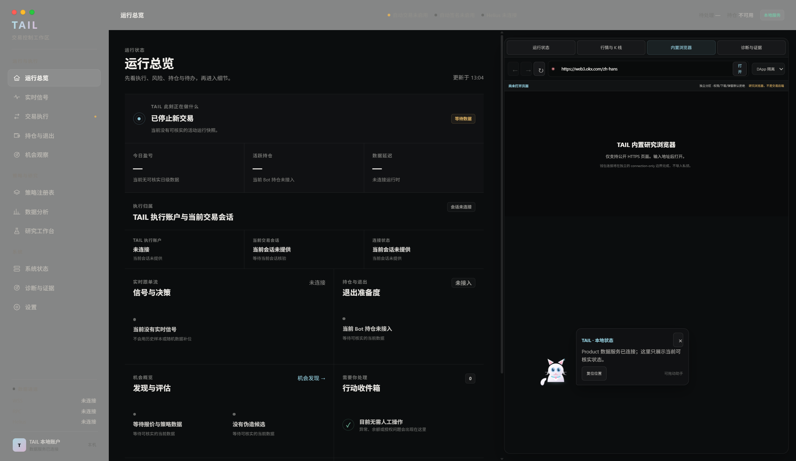
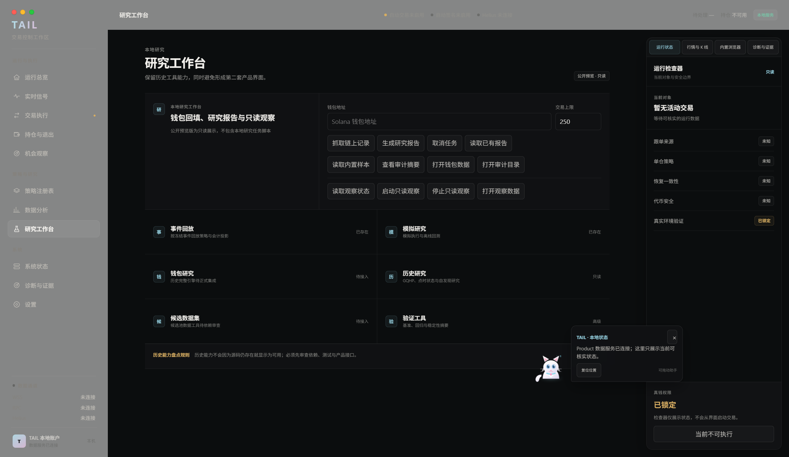
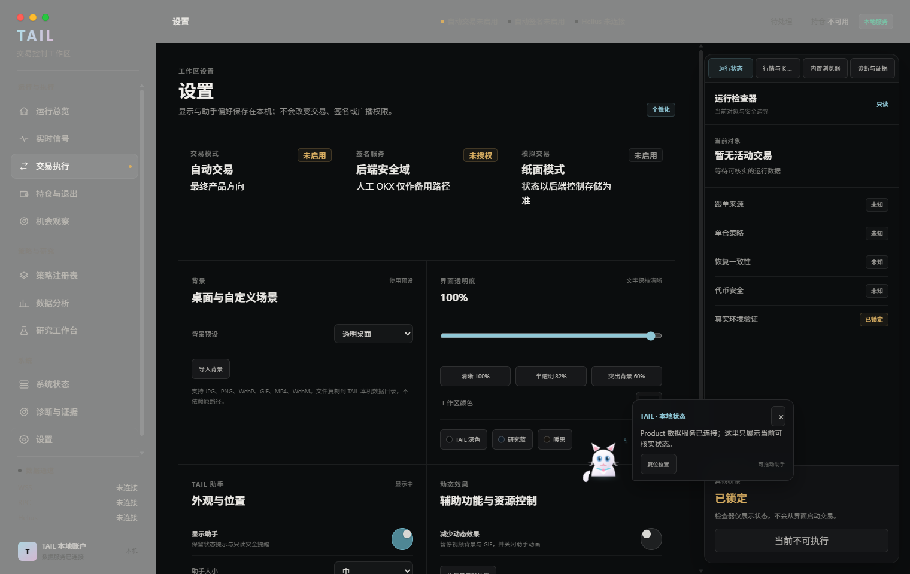
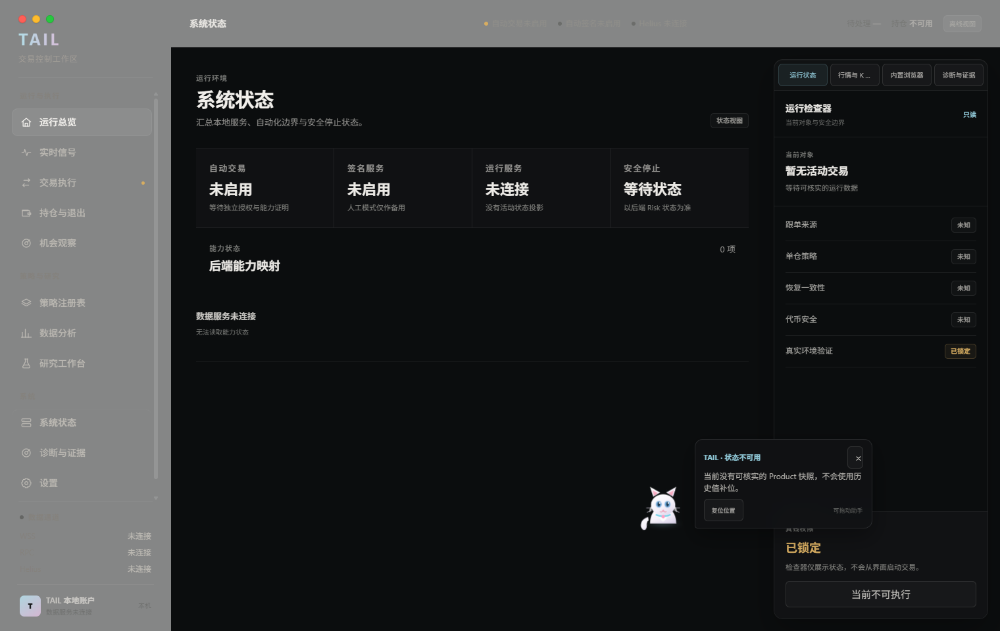

# 一分钟了解 TAIL 0.4.1

先用三组截图看看 TAIL 正在怎样组织工作区、呈现数据和区分样本。感兴趣后，再[下载 Windows 预览](https://github.com/Tailovo/tail-trading-workspace/releases/tag/v0.4.1-preview)体验本地交互。

以下截图来自 0.4.1 候选包或同一候选源码的 UI Harness（界面测试环境）。合成样本和 Fixture 均保留原有标识，不代表真实账户、实时市场或已完成的实盘流程。

## 第一步：了解工作区

左侧按运行、研究和系统分组，中央展示当前页面，右侧保留状态、行情、浏览器及诊断工具入口。先看布局是否符合你的习惯，再看状态说明是否容易理解。

图中的“未连接”“未知”和“已锁定”对应当前公开预览的数据与执行边界。

## 第二步：看一次合成回测的结果

数据分析页的“本地回测入口”可以运行内置合成样本。这里可以体验参数输入、运行操作和结果呈现；结果区域会明确说明样本来源。

下图展示的是合成样本运行结果，只用于验证界面与数据链路，不证明历史或未来收益。

## 第三步：看多条信息怎样排列

这组持仓视图使用 100 条固定测试样本，展示列表排列、信息密度与滚动场景。TEST / FIXTURE 标识说明它们是测试数据，不是用户持仓，也不代表 100 仓真实执行能力。

看完后，可以[分享一个使用场景](https://github.com/Tailovo/tail-trading-workspace/issues/new?template=product-feedback.yml)，也可以继续看下面的工具区与设置。

## 更多界面

行情与 K 线工具区

右侧可以切换到行情与 K 线模式。公开包不携带可核实行情源，因此截图显示暂不可用。

内置研究浏览器

浏览器工具区提供独立的 HTTPS 研究入口，并显示隔离配置。截图没有主动打开远程页面。

研究工作台

公开构建保留研究工作流的界面入口；私有研究任务脚本被物理排除，相关按钮保持只读。

个性化与助手

设置页保留背景、透明度、颜色、减少动画和助手显示/位置等本地偏好。这些设置不改变交易权限。

后端断连状态

当本地产品状态不可核实时，系统页显示未连接与等待状态，方便区分界面可用和数据是否就绪。

## 接下来值得关注

下一里程碑是让一条脱敏事件能被追踪到各步骤状态与最终证据。该流程仍是计划中的交付，具体验收方式见[路线图](ROADMAP.md)。

[下载当前预览](https://github.com/Tailovo/tail-trading-workspace/releases/tag/v0.4.1-preview) · [反馈一个问题](FEEDBACK.md) · [返回首页](README.md)

历史视频：0.0.1，约 52 秒

[查看 0.0.1 历史视频](https://github.com/Tailovo/tail-trading-workspace/releases/download/v0.0.1-preview/tail-early-preview-2026-09-01.mp4)。视频中的旧 UI 不代表当前 0.4.1。

