# TAIL 界面导览

更新日期：2026-09-17。先看当前开发界面，再看可下载的历史公开预览。

## 当前开发界面

本组 11 张图片来自现有 2026-09-16 Web 导出，在隔离浏览器中实际渲染。测试桥接提供未配置的空会话；除本地静态资源外的请求被阻止，未读取生产持仓、凭据或活动。右下角保留截图环境标识。

这些图片展示界面和空状态，不证明 Electron IPC、网络恢复或实盘交易通过，也不意味着 9 月 4 日的公开安装包包含这些新界面。

### 运行总览

会话状态、实际仓位和未决动作使用同一份会话投影。

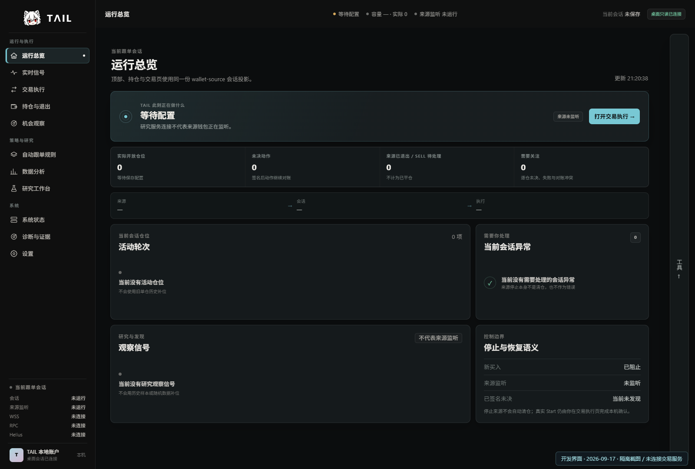

### 交易执行

当前会话配置表单，空配置展示输入校验；截图没有保存配置或启动。

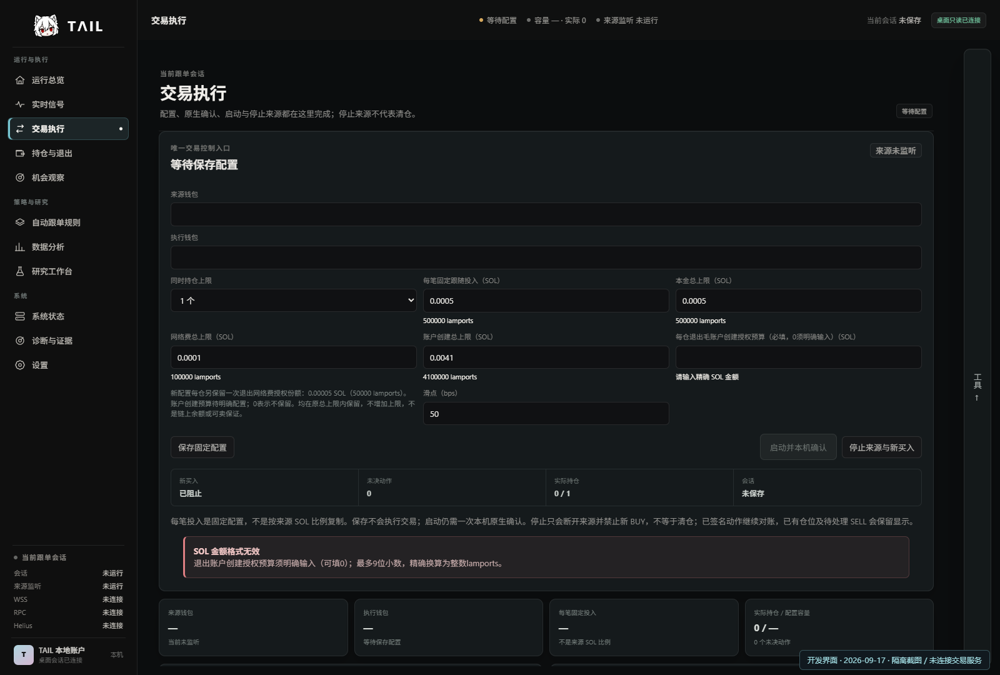

### 持仓与退出

逐仓展示区分自动完成和外部人工处置；此处为空会话。

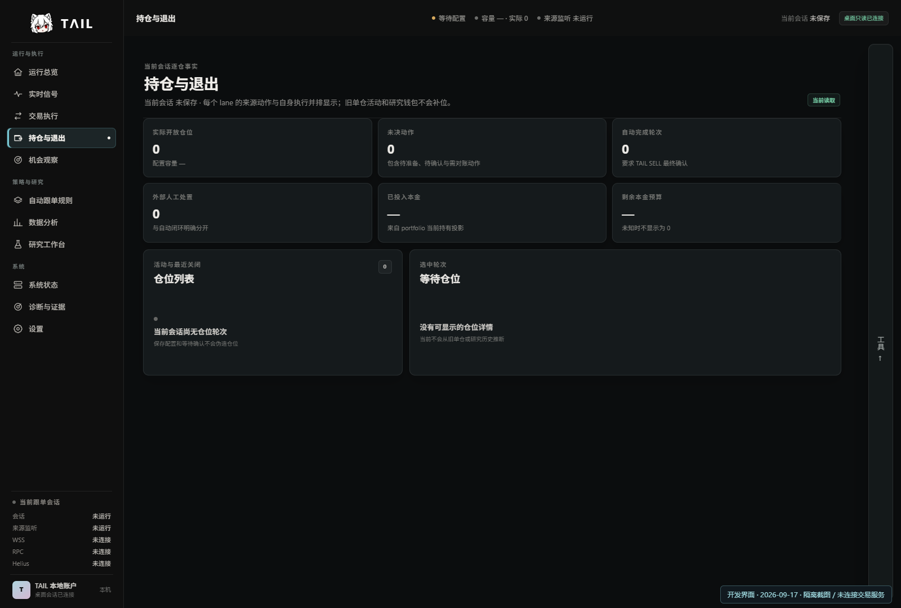

### 实时信号

来源或研究事件为空时保持空状态。

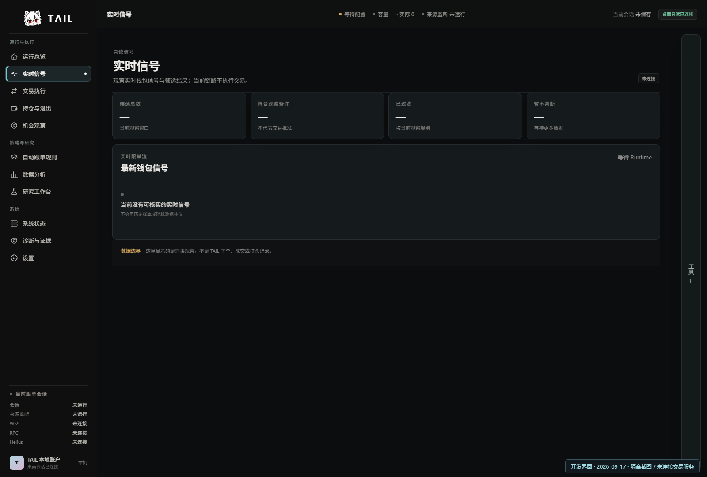

### 机会观察

观察候选不自动等于交易指令；截图未接入候选数据。

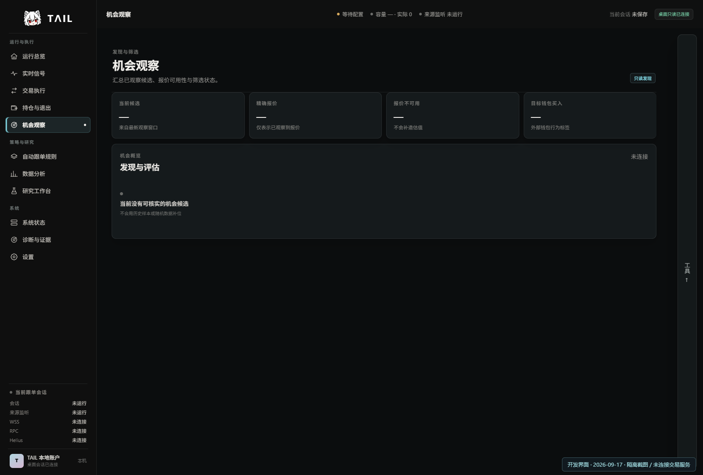

### 自动跟单规则

当前固定配置与来源会话规则说明。

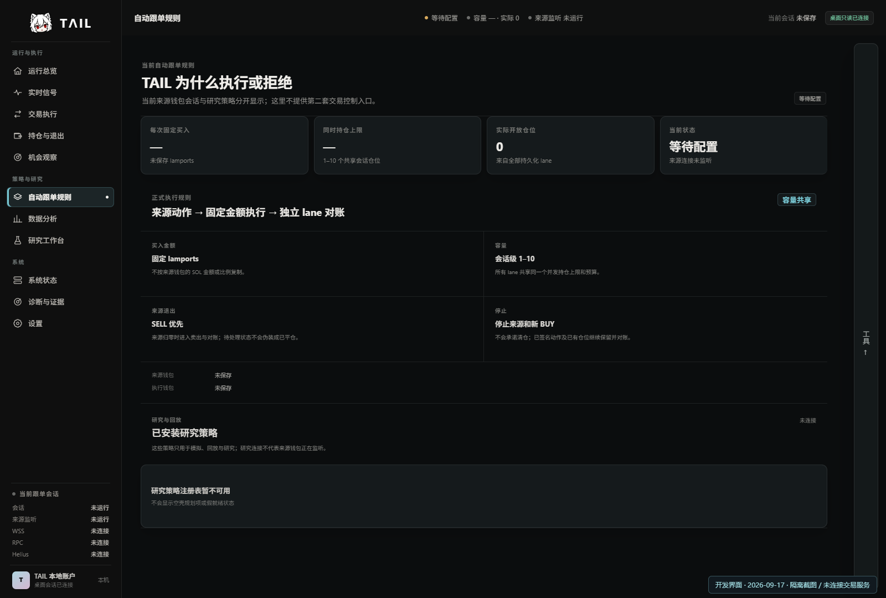

### 数据分析

会话时序与分析入口；没有真实会话时不填造结果。

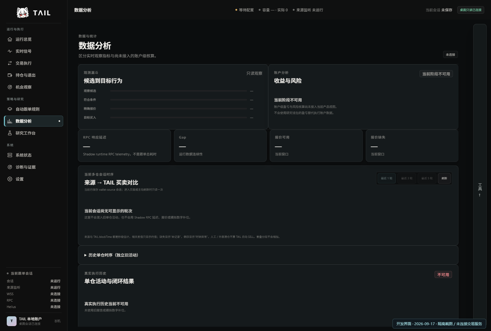

### 研究工作台

截图模式锁定研究任务，只展示工作区。

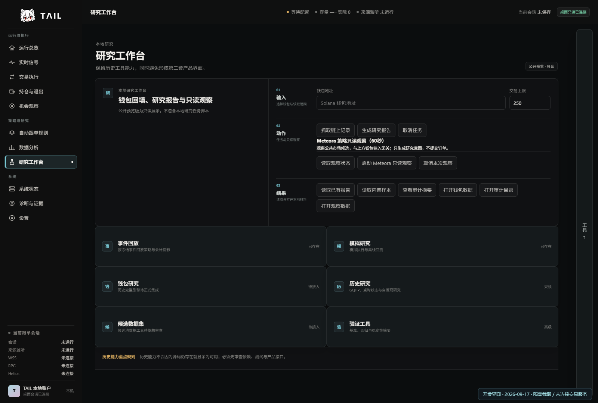

### 系统状态

展示服务和当前会话状态，未连接的服务明确显示未连接。

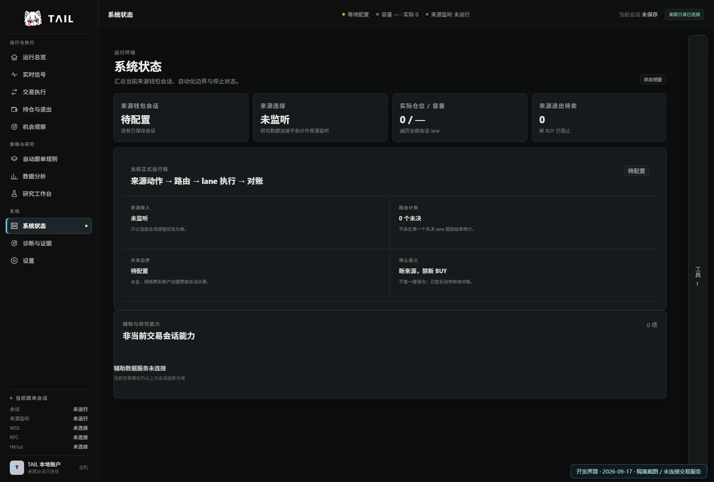

### 诊断与证据

查看运行路径与状态；截图不携带真实 journal。

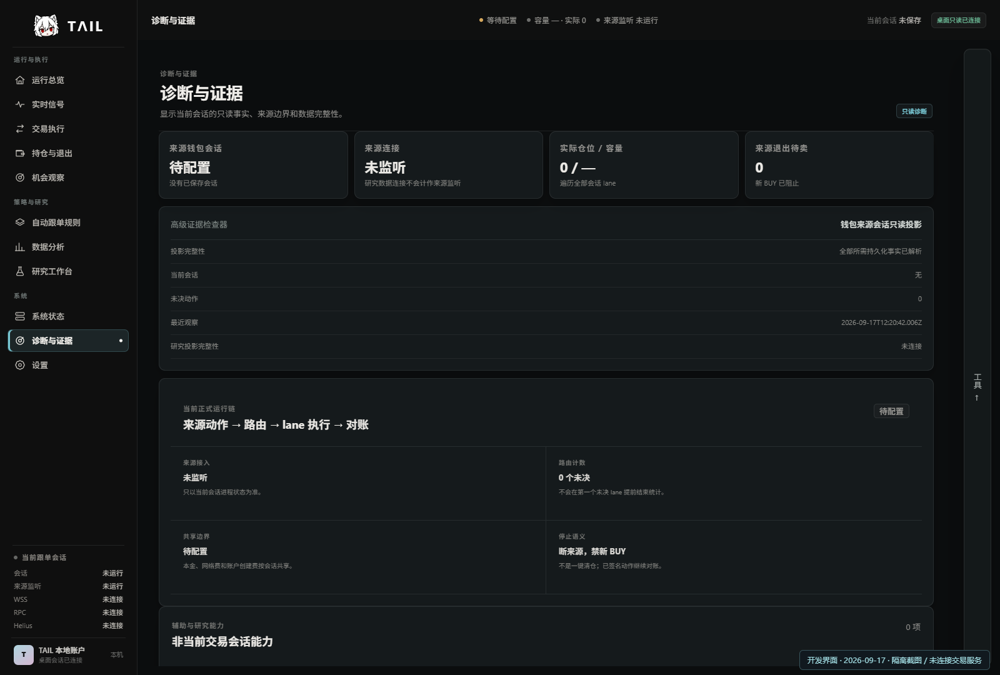

### 设置

桌面外观、透明度、背景与助手设置界面。

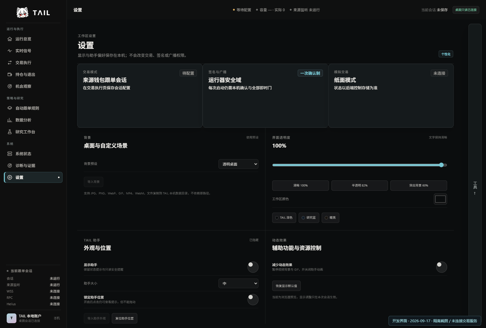

## 可下载的公开预览 0.4.1

以下图片保留原日期与版本，来自已发布的只读包或同版本 UI Harness。合成回测与固定样本不代表真实持仓、收益或容量。

### 公开预览工作区

### 内置合成回测

### 固定持仓测试样本

其他历史图片继续保留在 [截图目录](assets/screenshots/)。截图对应信息与 SHA-256 见 [本次图集清单](docs/screenshot-manifest-2026-09-17.json)。

[下载公开预览](https://github.com/Tailovo/tail-trading-workspace/releases/tag/v0.4.1-preview) · [当前状态](STATUS.md) · [返回首页](README.md)
