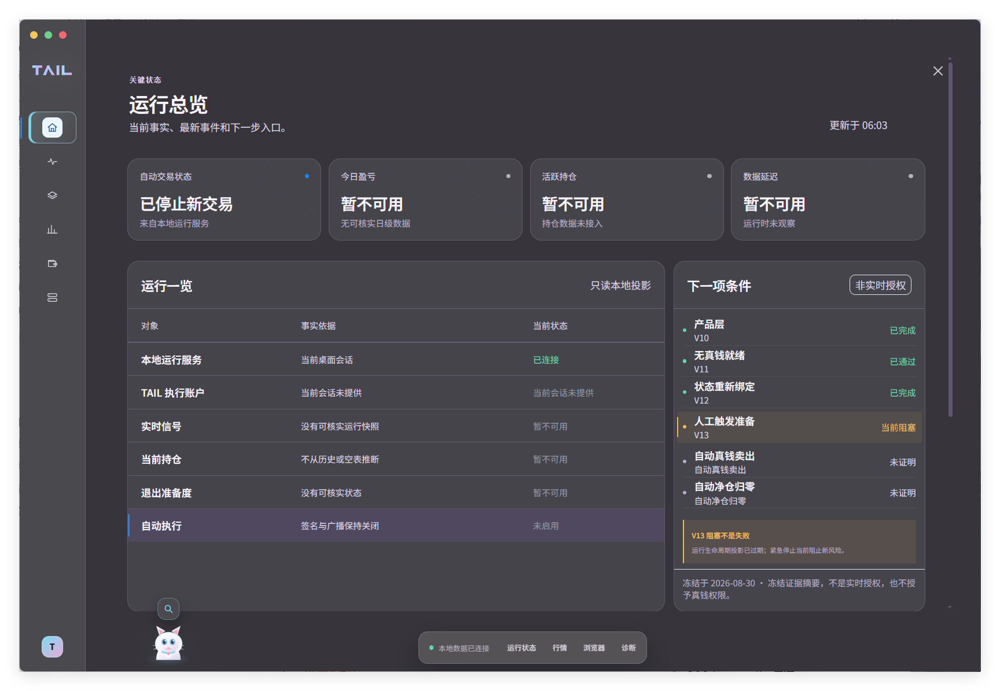
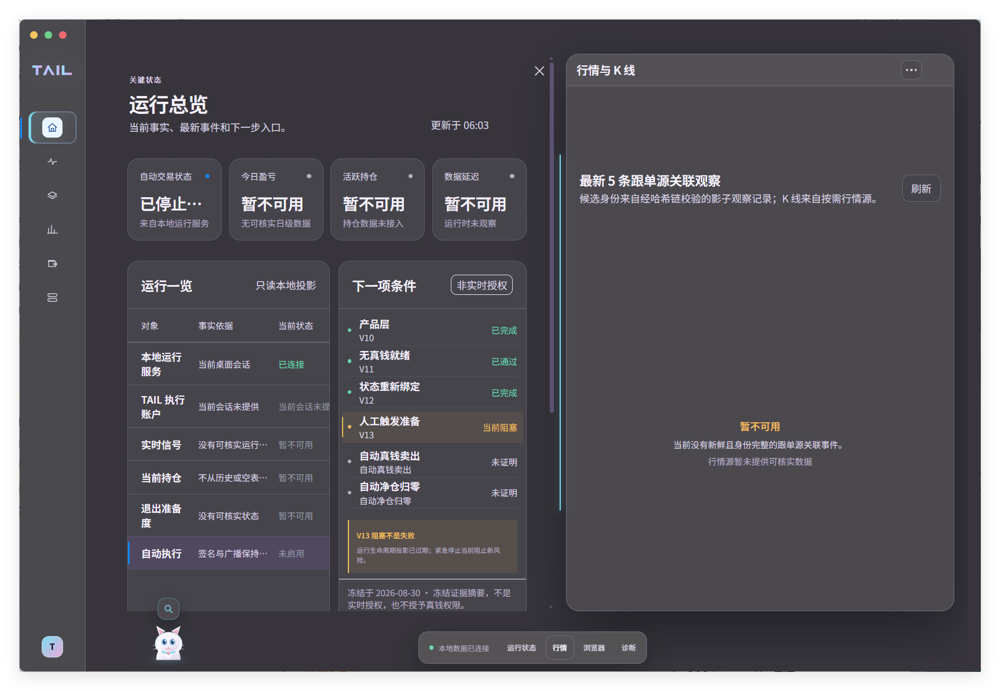
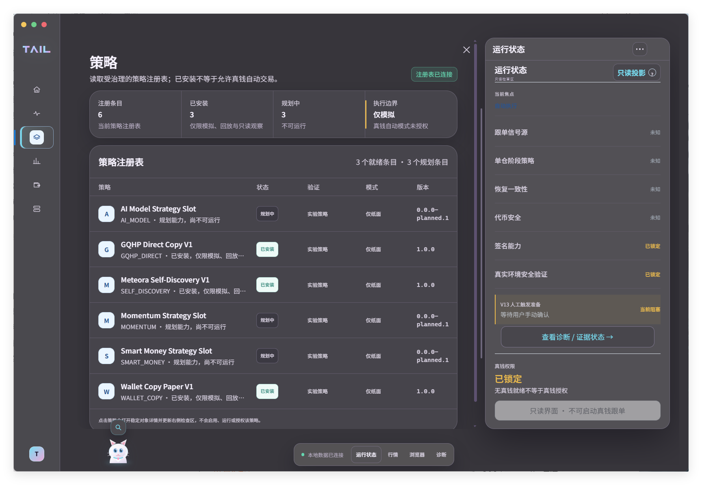
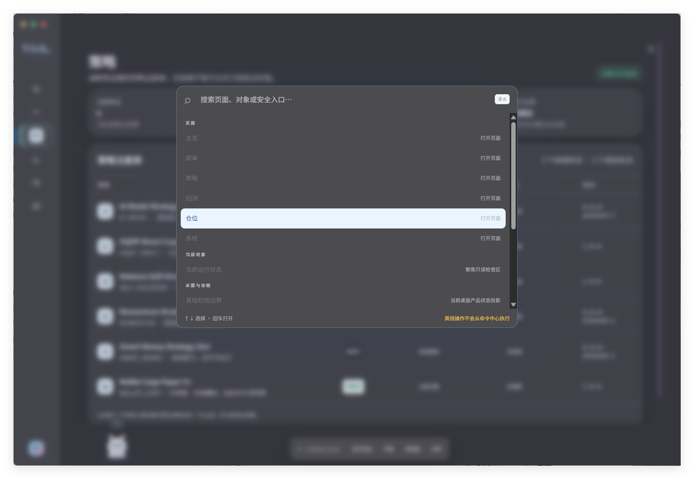
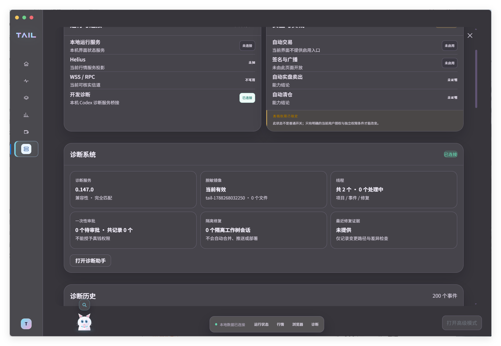
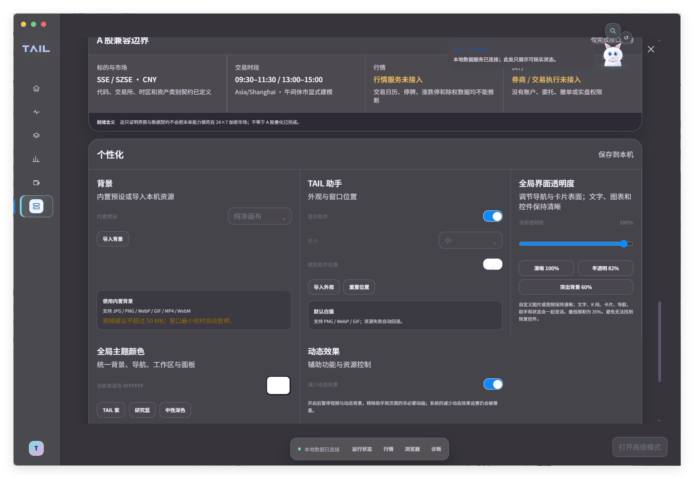

# TAIL 界面与功能导览

这组图片来自 TAIL 当前的早期开发版本。它们用于展示工作台已经形成的产品表面，也会如实保留当前未接入、不可用或未证明的状态。

## 运行总览

总览页把本地服务、执行账户、实时信号、持仓与自动执行状态放在同一处，并明确标出当前可核实事实与下一项安全条件。

## 可调工作区与行情面板

右侧面板可以按需要展开和调整空间。当前没有完整、可核实的跟单源关联事件时，行情区域直接显示暂不可用，不用虚构 K 线填满画面。

## 策略注册表与运行边界

策略页把已安装、规划中、实验策略、运行模式和版本集中展示；右侧状态区同步显示签名能力、真实环境验证与人工触发条件。已安装只表示策略进入注册表，不等于获得真钱自动执行权限。

## 命令中心

命令中心用于快速打开页面、定位当前对象和进入证据或诊断区域。真钱操作不会从命令中心执行，避免把导航捷径误做成高风险操作入口。

## 本地诊断

系统页集中展示本地服务、行情通道、自动交易边界、诊断服务、线程、审批和修复记录。它的作用是帮助开发和排查，不会因为诊断服务已连接就推导出交易通道已经可用。

## 市场边界与个性化

工作台预留了 A 股交易时段、市场和执行适配边界，但截图中的未接入状态也说明：这只是界面与数据契约层面的准备，不代表 A 股量化或券商交易已经完成。个性化作为辅助能力，支持主题颜色、背景、透明度、工作区布局和助手外观。

## 演示视频

约 52 秒的早期版本演示包含简洁片头、功能章节提示和开发状态说明，已经作为 [v0.0.1-preview Release 资产](https://github.com/Tailovo/tail-trading-workspace/releases/download/v0.0.1-preview/tail-early-preview-2026-09-01.mp4) 单独发布。这样可以直接在线观看或下载，也不会让仓库的每次克隆都携带视频历史。

## 仍在继续

现在看到的不是最终版本。TAIL 仍在持续开发，界面、交互、数据接入与能力边界都会继续调整；截图和视频不构成真实资金、数千级容量或多市场实盘已经完成的证明。
